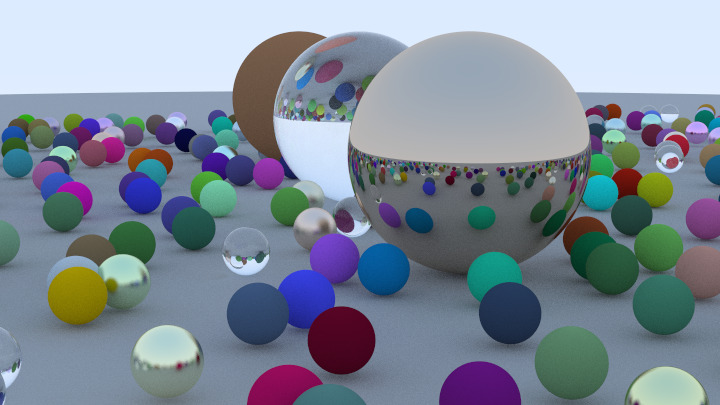

# Path Tracer

A work-in-progress Path Tracer based on Peter Shirley's book, currently using a naive brute force ray tracing algorithm, can simulate Lambert, Metallic, and Transparent objects. I am in the progress of porting the Path tracer to CUDA, which should (even with this brute force algorithm) provide massive gains in performance thanks to parallelism! (GPU MAGIC YAY!).

## Features
-Can Ray trace recursivly and iteratively (alhough im still at a loss as to why the iterative function is MASSIVELY slower than the recurive one)

-Stores image in a custom RAII compliant data structure.

-Iterates through each pixel in an image and shoots rays based on camera location and the screen onto which we are projeting said rays. Rays are then bounced about based on sphere intersections and colored (and scattered) accordingly.

-Has support for random unit in hemisphere scattering. 

-Plans to make the image exportable as a JPEG too, currently though it simply gets displayed as a texture in an OpenGL window. You can however store the image as a ppm file.